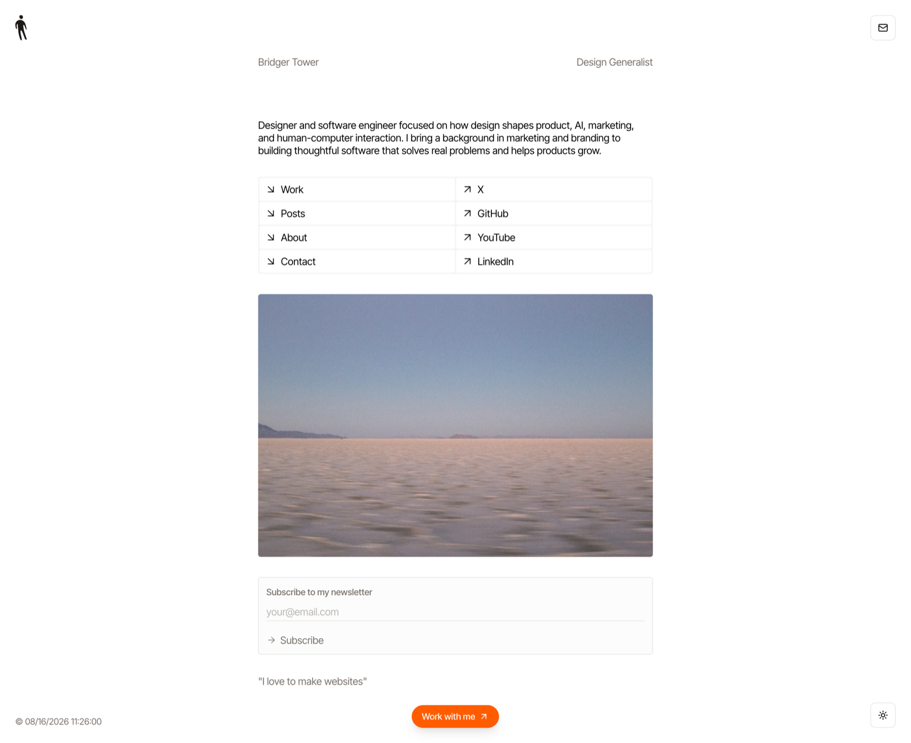

# iris


A camera for coding agents. One fast command or MCP tool call produces one trustworthy image.

```
iris example.com                        # 1440×900 @2x → example.com.png
iris --full --dark tailwindcss.com      # full page, dark color scheme
iris --size iphone stripe.com           # 390×844 @3x with a mobile UA
iris --selector '#hero' --padding 24 app.dev # first matching element, tightly framed
iris -o shots/ a.com b.com c.com        # batch, captured concurrently
cat urls.txt | iris - -o shots/         # batch from stdin (# comments ok)
iris -o hero.jpg --wait-for 'h1' app.dev
iris --selector 'h1' --json app.dev      # machine-readable JSON Lines
```

`iris --full bridger.to` →



## Install

```
curl -fsSL https://raw.githubusercontent.com/brijr/iris/main/install.sh | sh
```

Or with a Rust toolchain:

```
cargo install iris-screenshot
```

The crates.io package is named `iris-screenshot`; the installed command is `iris`.

The only runtime dependency is an installed Chrome-family browser (Chrome, Chromium, Edge, or Brave).
Building from source requires Rust 1.88 or newer.

## Give your coding agent eyes

Iris includes a local stdio MCP server in the same binary. Add it to Codex:

```
codex mcp add iris -- iris mcp
```

Or use the equivalent configuration in another MCP client:

```json
{
  "mcpServers": {
    "iris": {
      "command": "iris",
      "args": ["mcp"]
    }
  }
}
```

## Setup Prompt

The server exposes one tool, `capture`, which returns the image inline with structured metadata. It writes nothing by default; pass `output` when the agent also needs a file.

```json
{
  "url": "localhost:3000",
  "selector": "#pricing-card",
  "padding": 24,
  "size": "desktop",
  "dark": false,
  "format": "png",
  "timeout_seconds": 30,
  "output": "/tmp/pricing-card.png"
}
```

Bare localhost, `.localhost`, and loopback addresses use HTTP automatically. Other bare hosts use HTTPS. Run `iris mcp --help` to select a Chrome binary for the server.

MCP clients may need a fresh agent task before the newly registered `capture` tool appears.

Give this setup prompt to your coding agent</summary>

```text
Set up Iris as your visual camera in this coding environment.

Goal: install Iris, connect its local MCP server to this agent client, and prove
both the CLI and MCP paths work. Do not modify the application repository.

1. Check for an installed Chrome-family browser, `iris --version`, and an
   existing Iris MCP configuration.
2. If Iris is missing or outdated, install it with:

   curl -fsSL https://raw.githubusercontent.com/brijr/iris/main/install.sh | sh

   Or, when Rust is available:

   cargo install iris-screenshot

   Make sure the resulting `iris` command is on PATH.
3. Register the stdio MCP server without duplicating an existing entry.

   For Codex:

   codex mcp add iris -- iris mcp
   codex mcp get iris

   For another MCP client, configure command `iris` with args `["mcp"]`.
4. Prove the CLI works:

   iris https://example.com --selector h1 --padding 8 --scale 1 --json \
     -o /tmp/iris-smoke.png

   Confirm `status: ok` and a readable, non-empty PNG.
5. Reload the MCP configuration or start a fresh agent task if required. Call
   Iris's `capture` tool once for `https://example.com`, selecting the first
   `h1` with 8px padding and scale 1. Confirm an inline PNG and structured
   dimensions are returned.
6. Report the installed Iris version, MCP configuration, CLI smoke result, MCP
   smoke result, and any remaining blocker.

Do not claim MCP success from the CLI test alone. Do not add browser automation,
interaction scripting, or review tooling; use Iris only as the camera.
```

## What it does for you

- Renders with your real installed Chrome, driven over the DevTools Protocol
- Waits for fonts, image loads, entrance animations, and — on `--full` — scroll-triggers lazy-loaded content before capturing
- Captures the first matching element with `--selector`, automatically scrolling it into view and settling newly visible content before framing it
- Serves the same capture engine to coding agents with `iris mcp`, returning pixels inline instead of making the agent locate a file
- Retina `@2x` output by default; full pages taller than Chrome's ~16k px render limit fall back to `@1x` automatically (the report tells you which you got)
- Image format from the `-o` extension or `--format`: `png` (default), `jpg`, `webp` (JPEG/WebP encode at quality 90)
- One browser process, concurrent tabs; a failed URL prints `✗` and never kills the batch (exit code 1 if anything failed)
- Batch filenames derive from the URL (`example.com-pricing.png`); collisions get `-2`, `-3` suffixes
- `--json` writes one JSON object per completed capture to stdout, in concurrent completion order; capture failures are JSON too and still produce exit code 1

Element capture is intentionally CSS-selector based: Iris captures the first match in document order. `--selector` conflicts with `--full`; `--padding` requires it. Cross-origin iframe contents and capturing every match are not supported.

```json
{"status":"ok","url":"https://example.com/","output":"/absolute/example.com.png","mode":"element","selector":"h1","padding":24,"css_width":180,"css_height":72,"scale":2.0,"format":"png","bytes":14231}
```

## Benchmarking

Capture time includes navigation and Iris's correctness waits, so compare the same URL, capture mode, viewport, scale, Chrome version, and hardware. Prefer a deterministic local page when comparing releases; public URLs add network and server variance.

For a repeatable one-shot CLI benchmark from this repository, install [hyperfine](https://github.com/sharkdp/hyperfine) and run:

```sh
cargo build --release
hyperfine --warmup 1 --runs 10 \
  './target/release/iris file://$PWD/tests/fixtures/precise-capture.html \
    --selector .capture-target --padding 24 --scale 1 \
    -o /tmp/iris-benchmark.png'
```

The CLI starts a Chrome process for every invocation. MCP keeps one Chrome process alive for the server's lifetime, so benchmark it separately: initialize once, record the first `capture`, then report the median and p95 of at least ten identical subsequent calls. Measure from JSON-RPC request to complete tool response and exclude model time.

Reference results (not a performance guarantee):

| Iris | Machine | Chrome | Workload | Result |
| --- | --- | --- | --- | --- |
| 0.4.1 | Apple M2 Max, macOS 26.5.2 | 151.0.7922.138 | One-shot CLI, 10 runs after one warmup | 1.00 s median |
| 0.4.1 | Apple M2 Max, macOS 26.5.2 | 151.0.7922.138 | MCP first capture | 965 ms |
| 0.4.1 | Apple M2 Max, macOS 26.5.2 | 151.0.7922.138 | MCP next 10 captures | 366 ms median, 383 ms p95 |

All reference runs used the local `precise-capture.html` fixture, `.capture-target`, 24px padding, PNG, and scale 1. Record `iris --version`, the Chrome version, and the exact command with any published result.

## Flags

```
-o, --out <PATH>       output file (single URL) or directory (batch)
-s, --size <SIZE>      WxH, or desktop (1440x900@2x) | iphone (390x844@3x) | ipad (1024x1366@2x)
    --full             capture the full page height
    --selector <CSS>   capture the first element matching a CSS selector
    --padding <PX>     nonnegative CSS-pixel padding around a selected element
    --dark             emulate prefers-color-scheme: dark
    --format <FMT>     png | jpg | webp (a recognized --out extension wins)
    --wait <MS>        extra settle delay after smart waiting
    --wait-for <CSS>   wait until a selector exists before capturing
    --scale <N>        device scale factor (overrides the preset's)
    --jobs <N>         concurrent captures (default: min(4, URLs))
    --timeout <SECS>   per-page budget (default: 30)
    --chrome <PATH>    browser binary (auto-detected; also via $CHROME)
    --json             emit one JSON object per completed capture
```

`iris mcp [--chrome <PATH>]` serves the single-image `capture` tool over stdio. Batch capture, browser interaction scripting, diffs, and review workflows remain outside Iris.

## License

[MIT](LICENSE)
